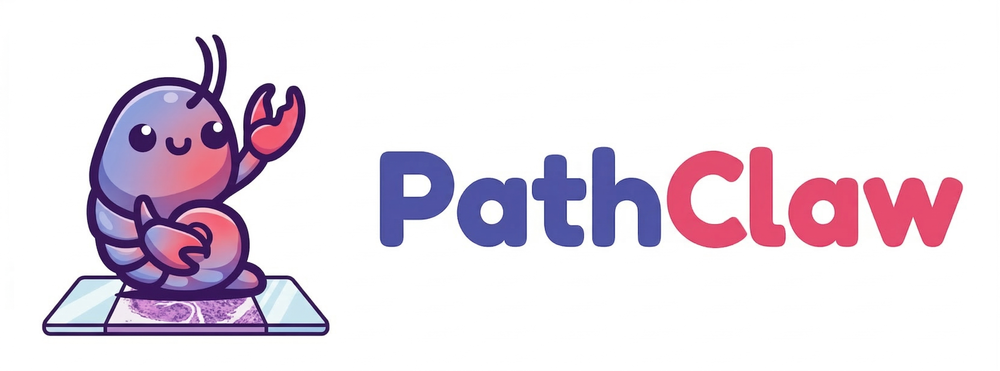

<p align="center">
  
</p>

<p align="center">
  PathClaw is a NanoClaw-derived pathology assistant focused on whole-slide image viewing and agent-assisted WSI analysis.
</p>

## Demo


## What PathClaw Does

PathClaw currently centers on two skills:

- *WSI view skill*: inspect a local slide, read metadata, generate thumbnails, and extract regions of interest
- *WSI analysis skill*: use an agent workflow to propose ROIs and analyze pathology image content step by step

This repo is intentionally narrow. It is not trying to document every NanoClaw feature.

## Current Workflow

For a WSI analysis request, PathClaw can:

1. Open a local slide mounted into the container workspace
2. Render a thumbnail
3. Parse filename priors such as TCGA-style metadata when available
4. Ask the analysis workflow to suggest ROIs worth examining at higher power
5. Render those ROIs from the original slide
6. Send the thumbnail, ROI overlay, and ROI images back through Telegram step by step
7. Generate ROI-level and whole-case observations
8. Return a structured pathology summary

## WSI View Skill

The built-in WSI tooling supports:

- listing supported slide files
- inspecting slide dimensions, pyramid levels, downsample factors, and metadata
- rendering thumbnails
- extracting ROIs at a selected pyramid level or approximate target MPP

Supported local formats currently include:

- `.svs`
- `.tif`
- `.tiff`
- `.ndpi`
- `.scn`
- `.bif`
- `.qptiff`

Generated outputs are written into the active group workspace and can be sent back to chat.

For slides that contain multiple disconnected tissue pieces, PathClaw can also run a separate tissue-separation preprocessing step so downstream analysis can treat each specimen as its own image unit.

## WSI Analysis Skill

The `wsi-analysis` skill is the higher-level pathology workflow.

It is designed to stream intermediate steps back to the user:

1. Thumbnail plus background priors
2. ROI search progress message
3. Annotated thumbnail with ROI boxes
4. ROI-by-ROI rationale
5. Each ROI image
6. The agent's thought for each ROI
7. Final integrated summary

Current design:

- *Agent workflow*: orchestration, ROI proposal, image review, and structured reporting

## Quick Start

Requirements:

- macOS or Linux
- Node.js 20+
- Docker or Apple Container
- Claude Code
- Telegram bot token
- API key required by the analysis skill

Basic setup:

```bash
git clone https://github.com/JamesQFreeman/PathClaw.git
cd PathClaw
npm install
npm run build
```

Set required environment variables in `.env`:

```bash
TELEGRAM_BOT_TOKEN=...
CLAUDE_CODE_OAUTH_TOKEN=...
GEMINI_API_KEY=...
```

Build the agent container:

```bash
cd container
docker build -t nanoclaw-agent:latest .
cd ..
```

Then start the service with your normal PathClaw setup flow.

## Example Requests

Examples of the intended interaction style:

```text
@PathClaw inspect /workspace/extra/slides/TCGA-A6-2686-01Z-00-DX1.svs
@PathClaw show me a thumbnail of this slide
@PathClaw render a 1024px thumbnail and extract a region around the tumor edge
@PathClaw analyze this WSI and show me each ROI step by step
```

## Architecture

PathClaw keeps the host side small:

- host orchestrator in TypeScript
- isolated container execution for agent runs
- WSI access through `tiffslide`
- pathology analysis scripts for ROI proposal and slide interpretation
- Telegram-first image delivery through ordered media messages

Important pieces:

- [src/index.ts](src/index.ts)
- [src/container-runner.ts](src/container-runner.ts)
- [container/agent-runner/wsi_mcp.py](container/agent-runner/wsi_mcp.py)
- [container/skills/wsi-analysis/SKILL.md](container/skills/wsi-analysis/SKILL.md)

## Status

PathClaw v0.0.1 is an early pathology-focused release.

Current scope:

- local mounted slide files
- Telegram delivery
- thumbnail and ROI rendering
- agent-assisted ROI proposal and slide interpretation

Not yet a focus:

- cloud-backed slide sources
- broad channel support documentation
- polished benchmarked pathology prompts across many specimen types

## Important Disclaimer

PathClaw is an experimental research workflow for pathology images.

It is not a medical device, not a validated diagnostic system, and should not be used as a sole basis for clinical decisions.

## Attribution

PathClaw is built on top of NanoClaw:

- [NanoClaw upstream](https://github.com/qwibitai/nanoclaw)

## License

MIT
